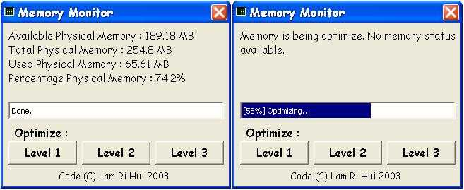



## Memory Monitor \(Monitor and recover lost memory\!\)

### Description

Every time when you start an application, the application 'borrows' the memory. When you exit the application, it will sometimes 'forget' to 'return' the memory to the system. Thus, the free memory available on your system will be less until you reboot your system. To over come this problem, you need a program to optimize and recover the 'lost' memory. This code act like a program to optimize and recover lost memory. To create a program to optimize and recover lost memory, you only need 2 API. That is 'GlobalMemoryStatus' to get memory status and 'SetWindowPos' to set the window always on top. Comments are welcomed. Please vote for this code.
 
### More Info
 

             |
---                |---
**Submitted On**   |2003-10-17 09:24:50
**By**             |[Lam Ri Hui](https://github.com/Planet-Source-Code/PSCIndex/blob/master/ByAuthor/lam-ri-hui.md)
**Level**          |Beginner
**User Rating**    |5.0 (20 globes from 4 users)
**Compatibility**  |VB 4\.0 \(16\-bit\), VB 4\.0 \(32\-bit\), VB 5\.0, VB 6\.0
**Category**       |[Complete Applications](https://github.com/Planet-Source-Code/PSCIndex/blob/master/ByCategory/complete-applications__1-27.md)
**World**          |[Visual Basic](https://github.com/Planet-Source-Code/PSCIndex/blob/master/ByWorld/visual-basic.md)
**Archive File**   |[Memory\_Mon16602610172003\.zip](https://github.com/Planet-Source-Code/lam-ri-hui-memory-monitor-monitor-and-recover-lost-memory__1-49222/archive/master.zip)

